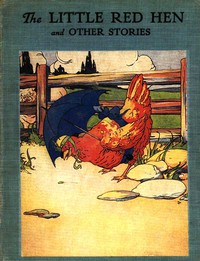

# The Little Red Hen: An Old English Folk Tale <kbd>v2.3.0</kbd>

## Authors

## Translators

## Subjects

 - Animals
 - Chickens

## Readablility

 - **A1:** 68%
 - **A2:** 76%
 - **B1:** 85%
 - **B2:** 93%
 - **C1:** 99%
 - **C2:** 100%

## Words Count

 - **A1:** 267
 - **A2:** 126
 - **B1:** 174
 - **B2:** 192
 - **C1:** 127
 - **C2:** 31

## Source

<kbd>GUTHENBURGE:18735</kbd>
