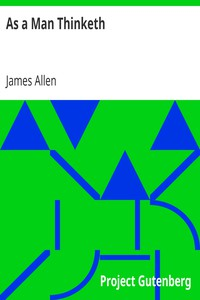

# As a Man Thinketh <kbd>v2.2.1</kbd>

## Authors

 - Allen, James <small>(1864 - 1912)</small>

## Translators

## Subjects

 - New Thought

## Readablility

 - **A1:** 70%
 - **A2:** 78%
 - **B1:** 85%
 - **B2:** 92%
 - **C1:** 98%
 - **C2:** 100%

## Words Count

 - **A1:** 346
 - **A2:** 219
 - **B1:** 343
 - **B2:** 422
 - **C1:** 361
 - **C2:** 157

## Source

<kbd>GUTHENBURGE:4507</kbd>
