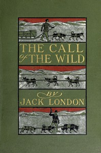

# The Call of the Wild <kbd>v2.2.1</kbd>

## Authors

 - London, Jack <small>(1876 - 1916)</small>

## Translators

## Subjects

 - Adventure stories
 - Animal welfare
 - Dogs
 - Feral dogs
 - Klondike River Valley (Yukon)
 - Nature stories
 - Pet theft
 - Sled dogs

## Readablility

 - **A1:** 73%
 - **A2:** 79%
 - **B1:** 85%
 - **B2:** 91%
 - **C1:** 96%
 - **C2:** 100%

## Words Count

 - **A1:** 468
 - **A2:** 403
 - **B1:** 628
 - **B2:** 843
 - **C1:** 884
 - **C2:** 561

## Source

<kbd>GUTHENBURGE:215</kbd>
