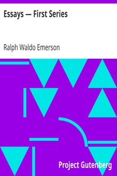

# Essays — First Series <kbd>v2.3.0</kbd>

## Authors

 - Emerson, Ralph Waldo <small>(1803 - 1882)</small>

## Translators

## Subjects

 - American essays

## Readablility

 - **A1:** 74%
 - **A2:** 80%
 - **B1:** 86%
 - **B2:** 93%
 - **C1:** 97%
 - **C2:** 100%

## Words Count

 - **A1:** 490
 - **A2:** 466
 - **B1:** 864
 - **B2:** 1377
 - **C1:** 1749
 - **C2:** 1353

## Source

<kbd>GUTHENBURGE:2944</kbd>
