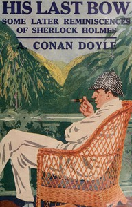

# His Last Bow: An Epilogue of Sherlock Holmes <kbd>v2.2.1</kbd>

## Authors

 - Doyle, Arthur Conan <small>(1859 - 1930)</small>

## Translators

## Subjects

 - Detective and mystery stories
 - Holmes, Sherlock (Fictitious character)
 - Private investigators

## Readablility

 - **A1:** 77%
 - **A2:** 83%
 - **B1:** 89%
 - **B2:** 94%
 - **C1:** 98%
 - **C2:** 100%

## Words Count

 - **A1:** 488
 - **A2:** 466
 - **B1:** 822
 - **B2:** 1163
 - **C1:** 1246
 - **C2:** 747

## Source

<kbd>GUTHENBURGE:2350</kbd>
