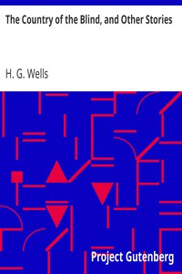

# The Country of the Blind, and Other Stories <kbd>v2.2.1</kbd>

## Authors

 - Wells, H. G. (Herbert George) <small>(1866 - 1946)</small>

## Translators

## Subjects

 - Science fiction, English

## Readablility

 - **A1:** 76%
 - **A2:** 82%
 - **B1:** 87%
 - **B2:** 93%
 - **C1:** 97%
 - **C2:** 100%

## Words Count

 - **A1:** 494
 - **A2:** 488
 - **B1:** 947
 - **B2:** 1674
 - **C1:** 2375
 - **C2:** 2013

## Source

<kbd>GUTHENBURGE:11870</kbd>
