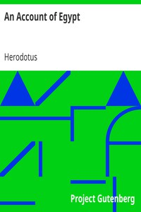

# An Account of Egypt <kbd>v2.3.0</kbd>

## Authors

 - Herodotus <small>(-484 - -430)</small>

## Translators

 - Macaulay, G. C. (George Campbell) <small>(1852 - 1915)</small>

## Subjects

 - Egypt

## Readablility

 - **A1:** 79%
 - **A2:** 85%
 - **B1:** 90%
 - **B2:** 95%
 - **C1:** 99%
 - **C2:** 100%

## Words Count

 - **A1:** 470
 - **A2:** 369
 - **B1:** 582
 - **B2:** 727
 - **C1:** 635
 - **C2:** 275

## Source

<kbd>GUTHENBURGE:2131</kbd>
