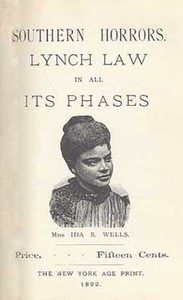

# Southern Horrors: Lynch Law in All Its Phases <kbd>v2.2.1</kbd>

## Authors

 - Wells-Barnett, Ida B. <small>(1862 - 1931)</small>

## Translators

## Subjects

 - Lynching

## Readablility

 - **A1:** 73%
 - **A2:** 79%
 - **B1:** 86%
 - **B2:** 93%
 - **C1:** 98%
 - **C2:** 100%

## Words Count

 - **A1:** 414
 - **A2:** 286
 - **B1:** 399
 - **B2:** 482
 - **C1:** 377
 - **C2:** 166

## Source

<kbd>GUTHENBURGE:14975</kbd>
