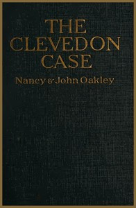

# The Clevedon Case <kbd>v2.3.0</kbd>

## Authors

 - Oakley, Nancy (Novelist) <small>(-1 - -1)</small>
 - Oakley, John <small>(1868 - 1945)</small>

## Translators

## Subjects

 - Criminologists
 - Detective and mystery stories
 - England
 - Murder

## Readablility

 - **A1:** 79%
 - **A2:** 84%
 - **B1:** 90%
 - **B2:** 95%
 - **C1:** 99%
 - **C2:** 100%

## Words Count

 - **A1:** 486
 - **A2:** 440
 - **B1:** 725
 - **B2:** 1016
 - **C1:** 996
 - **C2:** 520

## Source

<kbd>GUTHENBURGE:68091</kbd>
