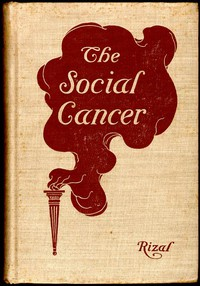

# The Social Cancer: A Complete English Version of Noli Me Tangere <kbd>v2.0.2</kbd>

## Authors

 - Rizal, José <small>(1861 - 1896)</small>

## Translators

 - Derbyshire, Charles E. <small>(-1 - -1)</small>

## Subjects

 - Historical fiction
 - Philippines

## Readablility

 - **A1:** 51%
 - **A2:** 59%
 - **B1:** 69%
 - **B2:** 82%
 - **C1:** 86%
 - **C2:** 100%

## Words Count

 - **A1:** 654
 - **A2:** 686
 - **B1:** 1244
 - **B2:** 2115
 - **C1:** 969
 - **C2:** 7903

## Source

<kbd>GUTHENBURGE:6737</kbd>
