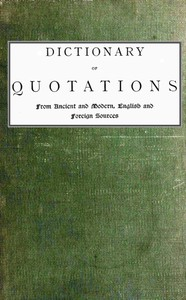

# Dictionary of Quotations from Ancient and Modern, English and Foreign Sources: Including Phrases, Mottoes, Maxims, Proverbs, Definitions, Aphorisms, and Sayings of Wise Men, in Their Bearing on Life, Literature, Speculation, Science, Art, Religion, and Morals, Especially in the Modern Aspects of Them <kbd>v2.3.0</kbd>

## Authors

 - Wood, James, Rev. <small>(1820 - 1901)</small>

## Translators

## Subjects

 - Aphorisms and apothegms
 - Quotations
 - Quotations

## Readablility

 - **A1:** 75%
 - **A2:** 80%
 - **B1:** 86%
 - **B2:** 92%
 - **C1:** 96%
 - **C2:** 100%

## Words Count

 - **A1:** 494
 - **A2:** 496
 - **B1:** 983
 - **B2:** 1874
 - **C1:** 3422
 - **C2:** 4142

## Source

<kbd>GUTHENBURGE:48105</kbd>
