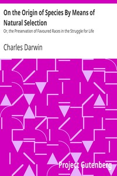

# On the Origin of Species By Means of Natural Selection: Or, the Preservation of Favoured Races in the Struggle for Life <kbd>v2.0.9</kbd>

## Authors

 - Darwin, Charles <small>(1809 - 1882)</small>

## Translators

## Subjects

 - Evolution (Biology)
 - Natural selection

## Readablility

 - **A1:** 64%
 - **A2:** 72%
 - **B1:** 80%
 - **B2:** 87%
 - **C1:** 89%
 - **C2:** 100%

## Words Count

 - **A1:** 748
 - **A2:** 607
 - **B1:** 860
 - **B2:** 1085
 - **C1:** 334
 - **C2:** 3582

## Source

<kbd>GUTHENBURGE:1228</kbd>
