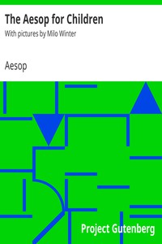

# The Aesop for Children: With pictures by Milo Winter <kbd>v2.2.1</kbd>

## Authors

 - Aesop <small>(-1 - -1)</small>

## Translators

## Subjects

 - Aesop's fables
 - Fables
 - Folklore

## Readablility

 - **A1:** 73%
 - **A2:** 79%
 - **B1:** 85%
 - **B2:** 91%
 - **C1:** 98%
 - **C2:** 100%

## Words Count

 - **A1:** 464
 - **A2:** 369
 - **B1:** 587
 - **B2:** 726
 - **C1:** 643
 - **C2:** 263

## Source

<kbd>GUTHENBURGE:19994</kbd>
