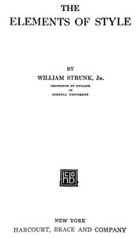

# The Elements of Style <kbd>v2.2.1</kbd>

## Authors

 - Strunk, William <small>(1869 - 1946)</small>

## Translators

## Subjects

 - English language
 - English language
 - Report writing

## Readablility

 - **A1:** 69%
 - **A2:** 76%
 - **B1:** 84%
 - **B2:** 91%
 - **C1:** 97%
 - **C2:** 100%

## Words Count

 - **A1:** 426
 - **A2:** 318
 - **B1:** 437
 - **B2:** 545
 - **C1:** 500
 - **C2:** 283

## Source

<kbd>GUTHENBURGE:37134</kbd>
