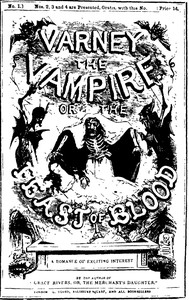

# Varney the Vampire; Or, the Feast of Blood <kbd>v2.2.1</kbd>

## Authors

 - Rymer, James Malcolm <small>(-1 - 1884)</small>
 - Prest, Thomas Peckett <small>(1810 - 1859)</small>

## Translators

## Subjects

 - Gothic fiction
 - Horror tales
 - Vampires

## Readablility

 - **A1:** 79%
 - **A2:** 84%
 - **B1:** 90%
 - **B2:** 94%
 - **C1:** 99%
 - **C2:** 100%

## Words Count

 - **A1:** 494
 - **A2:** 492
 - **B1:** 957
 - **B2:** 1758
 - **C1:** 2599
 - **C2:** 2000

## Source

<kbd>GUTHENBURGE:14833</kbd>
