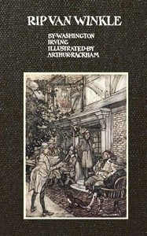

# Rip Van Winkle <kbd>v2.2.1</kbd>

## Authors

 - Irving, Washington <small>(1783 - 1859)</small>

## Translators

## Subjects

 - Catskill Mountains Region (N.Y.)
 - Fantasy fiction
 - Hudson River (N.Y. and N.J.)
 - New York (State)
 - Van Winkle, Rip (Fictitious character)

## Readablility

 - **A1:** 71%
 - **A2:** 77%
 - **B1:** 85%
 - **B2:** 92%
 - **C1:** 97%
 - **C2:** 100%

## Words Count

 - **A1:** 417
 - **A2:** 267
 - **B1:** 398
 - **B2:** 454
 - **C1:** 380
 - **C2:** 181

## Source

<kbd>GUTHENBURGE:60976</kbd>
