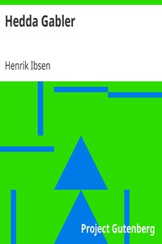

# Hedda Gabler <kbd>v2.3.0</kbd>

## Authors

 - Ibsen, Henrik <small>(1828 - 1906)</small>

## Translators

 - Gosse, Edmund <small>(1849 - 1928)</small>
 - Archer, William <small>(1856 - 1924)</small>

## Subjects

 - Identity (Psychology)
 - Man-woman relationships
 - Norwegian drama
 - Women

## Readablility

 - **A1:** 80%
 - **A2:** 85%
 - **B1:** 91%
 - **B2:** 96%
 - **C1:** 99%
 - **C2:** 100%

## Words Count

 - **A1:** 471
 - **A2:** 373
 - **B1:** 549
 - **B2:** 687
 - **C1:** 539
 - **C2:** 256

## Source

<kbd>GUTHENBURGE:4093</kbd>
