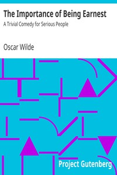

# The Importance of Being Earnest: A Trivial Comedy for Serious People <kbd>v2.0.9</kbd>

## Authors

 - Wilde, Oscar <small>(1854 - 1900)</small>

## Translators

## Subjects

 - Comedies
 - England
 - Foundlings
 - Identity (Psychology)

## Readablility

 - **A1:** 65%
 - **A2:** 72%
 - **B1:** 78%
 - **B2:** 83%
 - **C1:** 84%
 - **C2:** 100%

## Words Count

 - **A1:** 645
 - **A2:** 377
 - **B1:** 466
 - **B2:** 465
 - **C1:** 128
 - **C2:** 965

## Source

<kbd>GUTHENBURGE:844</kbd>
