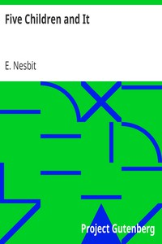

# Five Children and It <kbd>v2.3.0</kbd>

## Authors

 - Nesbit, E. (Edith) <small>(1858 - 1924)</small>

## Translators

## Subjects

 - Brothers and sisters
 - Fairies
 - Great Britain
 - Wishes

## Readablility

 - **A1:** 78%
 - **A2:** 83%
 - **B1:** 89%
 - **B2:** 94%
 - **C1:** 98%
 - **C2:** 100%

## Words Count

 - **A1:** 489
 - **A2:** 420
 - **B1:** 690
 - **B2:** 937
 - **C1:** 892
 - **C2:** 501

## Source

<kbd>GUTHENBURGE:17314</kbd>
