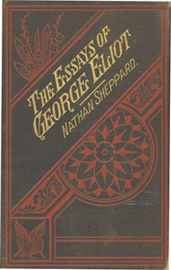

# The Essays of "George Eliot": Complete <kbd>v2.2.1</kbd>

## Authors

 - Eliot, George <small>(1819 - 1880)</small>

## Translators

## Subjects

 - Literature

## Readablility

 - **A1:** 73%
 - **A2:** 79%
 - **B1:** 85%
 - **B2:** 91%
 - **C1:** 97%
 - **C2:** 100%

## Words Count

 - **A1:** 493
 - **A2:** 486
 - **B1:** 943
 - **B2:** 1642
 - **C1:** 2248
 - **C2:** 1778

## Source

<kbd>GUTHENBURGE:28289</kbd>
