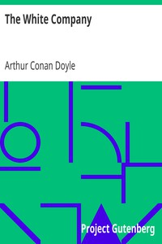

# The White Company <kbd>v2.3.0</kbd>

## Authors

 - Doyle, Arthur Conan <small>(1859 - 1930)</small>

## Translators

## Subjects

 - Archers
 - British
 - Historical fiction
 - Hundred Years' War, 1339-1453
 - Knights and knighthood
 - Middle Ages
 - War stories

## Readablility

 - **A1:** 77%
 - **A2:** 82%
 - **B1:** 87%
 - **B2:** 92%
 - **C1:** 97%
 - **C2:** 100%

## Words Count

 - **A1:** 489
 - **A2:** 468
 - **B1:** 879
 - **B2:** 1401
 - **C1:** 1807
 - **C2:** 1556

## Source

<kbd>GUTHENBURGE:903</kbd>
