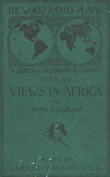

# The World and Its People, Book VII: Views in Africa <kbd>v2.2.1</kbd>

## Authors

 - Badlam, Anna B. <small>(-1 - -1)</small>

## Translators

## Subjects

 - Africa

## Readablility

 - **A1:** 70%
 - **A2:** 76%
 - **B1:** 84%
 - **B2:** 91%
 - **C1:** 97%
 - **C2:** 100%

## Words Count

 - **A1:** 491
 - **A2:** 482
 - **B1:** 933
 - **B2:** 1568
 - **C1:** 2129
 - **C2:** 1658

## Source

<kbd>GUTHENBURGE:35245</kbd>
