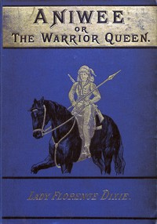

# Aniwee; or, the Warrior Queen: A tale of the Araucanian Indians and the mythical Trauco people <kbd>v2.0.2</kbd>

## Authors

 - Dixie, Florence, Lady <small>(1855 - 1905)</small>

## Translators

## Subjects

 - Mapuche Indians

## Readablility

 - **A1:** 50%
 - **A2:** 57%
 - **B1:** 68%
 - **B2:** 82%
 - **C1:** 86%
 - **C2:** 100%

## Words Count

 - **A1:** 529
 - **A2:** 476
 - **B1:** 797
 - **B2:** 1240
 - **C1:** 513
 - **C2:** 3213

## Source

<kbd>GUTHENBURGE:67965</kbd>
