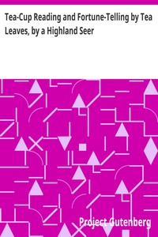

# Tea-Cup Reading and Fortune-Telling by Tea Leaves, by a Highland Seer <kbd>v2.2.1</kbd>

## Authors

## Translators

## Subjects

 - Fortune-telling by tea leaves

## Readablility

 - **A1:** 67%
 - **A2:** 75%
 - **B1:** 84%
 - **B2:** 91%
 - **C1:** 97%
 - **C2:** 100%

## Words Count

 - **A1:** 393
 - **A2:** 272
 - **B1:** 396
 - **B2:** 459
 - **C1:** 400
 - **C2:** 202

## Source

<kbd>GUTHENBURGE:18241</kbd>
