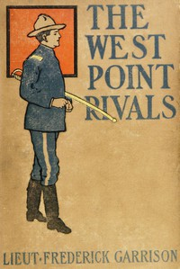

# The West Point Rivals: or, Mark Mallory's Stratagem <kbd>v2.2.1</kbd>

## Authors

 - Sinclair, Upton <small>(1878 - 1968)</small>

## Translators

## Subjects

 - Adventure stories
 - Conduct of life
 - Courage
 - Fighting (Psychology)
 - Friendship
 - Revenge
 - Soldiers
 - Students
 - Truthfulness and falsehood
 - United States Military Academy
 - Youth

## Readablility

 - **A1:** 75%
 - **A2:** 81%
 - **B1:** 87%
 - **B2:** 93%
 - **C1:** 98%
 - **C2:** 100%

## Words Count

 - **A1:** 486
 - **A2:** 450
 - **B1:** 775
 - **B2:** 1081
 - **C1:** 1102
 - **C2:** 689

## Source

<kbd>GUTHENBURGE:68041</kbd>
