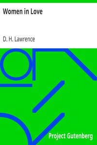

# Women in Love <kbd>v2.2.1</kbd>

## Authors

 - Lawrence, D. H. (David Herbert) <small>(1885 - 1930)</small>

## Translators

## Subjects

 - Coal mines and mining
 - Love stories
 - Male friendship
 - Midlands (England)
 - Psychological fiction
 - Sisters
 - Women

## Readablility

 - **A1:** 78%
 - **A2:** 83%
 - **B1:** 89%
 - **B2:** 94%
 - **C1:** 98%
 - **C2:** 100%

## Words Count

 - **A1:** 495
 - **A2:** 489
 - **B1:** 895
 - **B2:** 1519
 - **C1:** 2051
 - **C2:** 1832

## Source

<kbd>GUTHENBURGE:4240</kbd>
