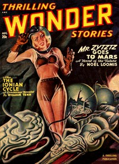

# Happy ending <kbd>v2.3.0</kbd>

## Authors

 - Moore, C. L. (Catherine Lucile) <small>(1911 - 1987)</small>
 - Kuttner, Henry <small>(1915 - 1958)</small>

## Translators

## Subjects

 - Robots
 - Science fiction
 - Short stories
 - Time travel

## Readablility

 - **A1:** 72%
 - **A2:** 78%
 - **B1:** 85%
 - **B2:** 92%
 - **C1:** 97%
 - **C2:** 100%

## Words Count

 - **A1:** 394
 - **A2:** 233
 - **B1:** 320
 - **B2:** 375
 - **C1:** 296
 - **C2:** 177

## Source

<kbd>GUTHENBURGE:68250</kbd>
