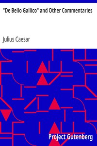

# "De Bello Gallico" and Other Commentaries <kbd>v2.3.0</kbd>

## Authors

 - Caesar, Julius <small>(-100 - -44)</small>

## Translators

 - McDevitte, W. A. (William Alexander) <small>(-1 - -1)</small>

## Subjects

 - Gaul
 - Rome

## Readablility

 - **A1:** 77%
 - **A2:** 84%
 - **B1:** 89%
 - **B2:** 95%
 - **C1:** 98%
 - **C2:** 100%

## Words Count

 - **A1:** 485
 - **A2:** 449
 - **B1:** 809
 - **B2:** 1317
 - **C1:** 1618
 - **C2:** 942

## Source

<kbd>GUTHENBURGE:10657</kbd>
