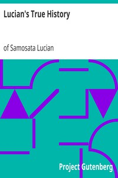

# Lucian's True History <kbd>v2.2.1</kbd>

## Authors

 - Lucian, of Samosata <small>(120 - 180)</small>

## Translators

 - Hickes, Francis <small>(1566 - 1631)</small>

## Subjects

 - Satire, Greek
 - Voyages, Imaginary

## Readablility

 - **A1:** 76%
 - **A2:** 82%
 - **B1:** 88%
 - **B2:** 94%
 - **C1:** 98%
 - **C2:** 100%

## Words Count

 - **A1:** 459
 - **A2:** 330
 - **B1:** 533
 - **B2:** 627
 - **C1:** 583
 - **C2:** 309

## Source

<kbd>GUTHENBURGE:45858</kbd>
