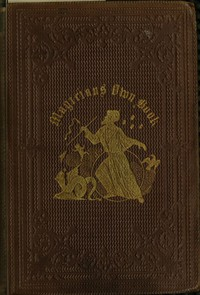

# The Magician's Own Book, or, the Whole Art of Conjuring: Being a complete hand-book of parlor magic, and containing over one thousand optical, chemical, mechanical, magnetical, and magical experiments, amusing transmutations, astonishing sleights and subtleties, celebrated card deceptions, ingenious tricks with numbers, curious and entertaining puzzles, together with all the most noted tricks of modern performers. <kbd>v2.3.0</kbd>

## Authors

 - Cahill, Frank <small>(-1 - -1)</small>
 - Arnold, George <small>(1834 - 1865)</small>

## Translators

## Subjects

 - Magic tricks
 - Tricks

## Readablility

 - **A1:** 72%
 - **A2:** 78%
 - **B1:** 85%
 - **B2:** 91%
 - **C1:** 97%
 - **C2:** 100%

## Words Count

 - **A1:** 490
 - **A2:** 457
 - **B1:** 815
 - **B2:** 1242
 - **C1:** 1523
 - **C2:** 1222

## Source

<kbd>GUTHENBURGE:60687</kbd>
