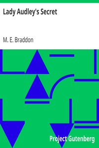

# Lady Audley's Secret <kbd>v2.3.0</kbd>

## Authors

 - Braddon, M. E. (Mary Elizabeth) <small>(1835 - 1915)</small>

## Translators

## Subjects

 - Bigamy
 - Deception
 - Domestic fiction
 - England
 - Married women
 - Psychological fiction

## Readablility

 - **A1:** 76%
 - **A2:** 82%
 - **B1:** 88%
 - **B2:** 94%
 - **C1:** 98%
 - **C2:** 100%

## Words Count

 - **A1:** 493
 - **A2:** 486
 - **B1:** 919
 - **B2:** 1573
 - **C1:** 2104
 - **C2:** 1485

## Source

<kbd>GUTHENBURGE:8954</kbd>
