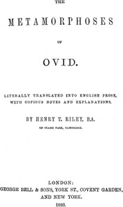

# The Metamorphoses of Ovid, Books I-VII <kbd>v2.2.1</kbd>

## Authors

 - Ovid <small>(-43 - 17)</small>

## Translators

 - Riley, Henry T. (Henry Thomas) <small>(1816 - 1878)</small>

## Subjects

 - Classical literature
 - Fables, Latin
 - Latin poetry
 - Metamorphosis
 - Mythology, Classical

## Readablility

 - **A1:** 75%
 - **A2:** 80%
 - **B1:** 86%
 - **B2:** 92%
 - **C1:** 97%
 - **C2:** 100%

## Words Count

 - **A1:** 491
 - **A2:** 466
 - **B1:** 857
 - **B2:** 1405
 - **C1:** 1788
 - **C2:** 1251

## Source

<kbd>GUTHENBURGE:21765</kbd>
