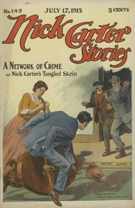

# Nick Carter Stories No. 149, July 17, 1915: A Network of Crime; or, Nick Carter's Tangled Skein. <kbd>v2.2.1</kbd>

## Authors

 - Carter, Nicholas (House name) <small>(-1 - -1)</small>
 - Boston, Ralph <small>(-1 - -1)</small>

## Translators

## Subjects

 - Detective and mystery stories, American
 - Popular literature

## Readablility

 - **A1:** 74%
 - **A2:** 80%
 - **B1:** 86%
 - **B2:** 92%
 - **C1:** 97%
 - **C2:** 100%

## Words Count

 - **A1:** 482
 - **A2:** 426
 - **B1:** 677
 - **B2:** 897
 - **C1:** 875
 - **C2:** 480

## Source

<kbd>GUTHENBURGE:68094</kbd>
