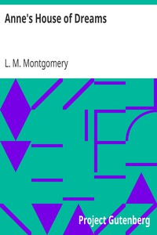

# Anne's House of Dreams <kbd>v2.2.1</kbd>

## Authors

 - Montgomery, L. M. (Lucy Maud) <small>(1874 - 1942)</small>

## Translators

## Subjects

 - Canada
 - Country life
 - Friendship
 - Marriage
 - Orphans
 - Prince Edward Island
 - Shirley, Anne (Fictitious character)
 - Young women

## Readablility

 - **A1:** 79%
 - **A2:** 85%
 - **B1:** 90%
 - **B2:** 95%
 - **C1:** 98%
 - **C2:** 100%

## Words Count

 - **A1:** 492
 - **A2:** 463
 - **B1:** 794
 - **B2:** 1197
 - **C1:** 1312
 - **C2:** 802

## Source

<kbd>GUTHENBURGE:544</kbd>
