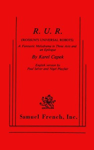

# R.U.R. (Rossum's Universal Robots): A Fantastic Melodrama in Three Acts and an Epilogue <kbd>v2.0.2</kbd>

## Authors

 - Čapek, Karel <small>(1890 - 1938)</small>

## Translators

 - Selver, Paul <small>(1888 - 1970)</small>
 - Playfair, Nigel <small>(1874 - 1934)</small>

## Subjects

 - Czech drama
 - Robots
 - Science fiction plays

## Readablility

 - **A1:** 46%
 - **A2:** 52%
 - **B1:** 63%
 - **B2:** 77%
 - **C1:** 80%
 - **C2:** 100%

## Words Count

 - **A1:** 466
 - **A2:** 371
 - **B1:** 521
 - **B2:** 687
 - **C1:** 243
 - **C2:** 1001

## Source

<kbd>GUTHENBURGE:59112</kbd>
