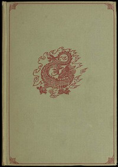

# Korean Folk Tales: Imps, Ghosts and Faries <kbd>v2.2.1</kbd>

## Authors

 - Yi, Yuk <small>(1438 - 1498)</small>
 - Im, Pang <small>(1640 - 1724)</small>

## Translators

 - Gale, James Scarth <small>(1863 - 1937)</small>

## Subjects

 - Folklore
 - Tales

## Readablility

 - **A1:** 78%
 - **A2:** 84%
 - **B1:** 90%
 - **B2:** 95%
 - **C1:** 98%
 - **C2:** 100%

## Words Count

 - **A1:** 487
 - **A2:** 444
 - **B1:** 737
 - **B2:** 952
 - **C1:** 824
 - **C2:** 427

## Source

<kbd>GUTHENBURGE:51002</kbd>
