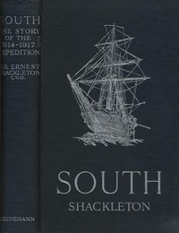

# South: The Story of Shackleton's Last Expedition, 1914-1917 <kbd>v2.3.0</kbd>

## Authors

 - Shackleton, Ernest Henry, Sir <small>(1874 - 1922)</small>

## Translators

## Subjects

 - Antarctica
 - Endurance (Ship)
 - Imperial Trans-Antarctic Expedition (1914-1917)
 - Shackleton, Ernest Henry, Sir, 1874-1922

## Readablility

 - **A1:** 71%
 - **A2:** 78%
 - **B1:** 85%
 - **B2:** 92%
 - **C1:** 97%
 - **C2:** 100%

## Words Count

 - **A1:** 479
 - **A2:** 460
 - **B1:** 851
 - **B2:** 1336
 - **C1:** 1666
 - **C2:** 1235

## Source

<kbd>GUTHENBURGE:5199</kbd>
