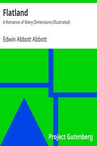

# Flatland: A Romance of Many Dimensions (Illustrated) <kbd>v2.0.2</kbd>

## Authors

 - Abbott, Edwin Abbott <small>(1838 - 1926)</small>

## Translators

## Subjects

 - Fourth dimension

## Readablility

 - **A1:** 51%
 - **A2:** 59%
 - **B1:** 70%
 - **B2:** 86%
 - **C1:** 89%
 - **C2:** 100%

## Words Count

 - **A1:** 506
 - **A2:** 443
 - **B1:** 690
 - **B2:** 976
 - **C1:** 373
 - **C2:** 1983

## Source

<kbd>GUTHENBURGE:201</kbd>
