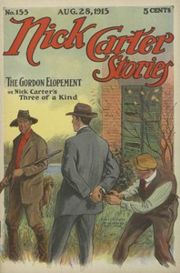

# Nick Carter Stories No. 155, August 28, 1915: The Gordon Elopement; or, Nick Carter's Three of a Kind. <kbd>v2.3.0</kbd>

## Authors

 - Carter, Nicholas (House name) <small>(-1 - -1)</small>
 - Lebhar, Bertram <small>(-1 - -1)</small>

## Translators

## Subjects

 - Detective and mystery stories, American
 - Popular literature

## Readablility

 - **A1:** 74%
 - **A2:** 80%
 - **B1:** 86%
 - **B2:** 91%
 - **C1:** 97%
 - **C2:** 100%

## Words Count

 - **A1:** 482
 - **A2:** 440
 - **B1:** 718
 - **B2:** 969
 - **C1:** 929
 - **C2:** 499

## Source

<kbd>GUTHENBURGE:68108</kbd>
