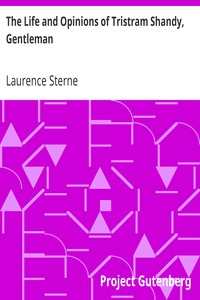

# The Life and Opinions of Tristram Shandy, Gentleman <kbd>v2.2.1</kbd>

## Authors

 - Sterne, Laurence <small>(1713 - 1768)</small>

## Translators

## Subjects

 - Experimental fiction
 - Fetus
 - Fiction
 - Infants
 - Stream of consciousness fiction

## Readablility

 - **A1:** 79%
 - **A2:** 84%
 - **B1:** 89%
 - **B2:** 94%
 - **C1:** 98%
 - **C2:** 100%

## Words Count

 - **A1:** 494
 - **A2:** 488
 - **B1:** 933
 - **B2:** 1609
 - **C1:** 2194
 - **C2:** 1752

## Source

<kbd>GUTHENBURGE:1079</kbd>
