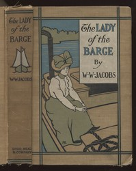

# The Monkey's Paw: The Lady of the Barge and Others, Part 2. <kbd>v2.3.0</kbd>

## Authors

 - Jacobs, W. W. (William Wymark) <small>(1863 - 1943)</small>

## Translators

## Subjects

 - Horror tales
 - Wishes

## Readablility

 - **A1:** 72%
 - **A2:** 79%
 - **B1:** 87%
 - **B2:** 94%
 - **C1:** 98%
 - **C2:** 100%

## Words Count

 - **A1:** 374
 - **A2:** 210
 - **B1:** 272
 - **B2:** 302
 - **C1:** 208
 - **C2:** 77

## Source

<kbd>GUTHENBURGE:12122</kbd>
