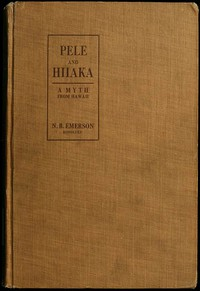

# Pele and Hiiaka: A Myth From Hawaii <kbd>v2.2.1</kbd>

## Authors

 - Emerson, Nathaniel Bright <small>(1839 - 1915)</small>

## Translators

## Subjects

 - Legends

## Readablility

 - **A1:** 78%
 - **A2:** 82%
 - **B1:** 87%
 - **B2:** 92%
 - **C1:** 97%
 - **C2:** 100%

## Words Count

 - **A1:** 492
 - **A2:** 442
 - **B1:** 804
 - **B2:** 1301
 - **C1:** 1532
 - **C2:** 1171

## Source

<kbd>GUTHENBURGE:60279</kbd>
