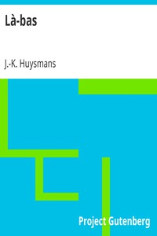

# Là-bas <kbd>v2.2.1</kbd>

## Authors

 - Huysmans, J.-K. (Joris-Karl) <small>(1848 - 1907)</small>

## Translators

 - Wallis, Keene <small>(-1 - -1)</small>

## Subjects

 - Erotic stories
 - France
 - Paranormal fiction
 - Rais, Gilles de, 1404-1440
 - Satanism

## Readablility

 - **A1:** 75%
 - **A2:** 80%
 - **B1:** 86%
 - **B2:** 91%
 - **C1:** 96%
 - **C2:** 100%

## Words Count

 - **A1:** 494
 - **A2:** 483
 - **B1:** 885
 - **B2:** 1470
 - **C1:** 1980
 - **C2:** 1787

## Source

<kbd>GUTHENBURGE:14323</kbd>
