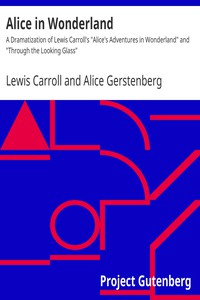

# Alice in Wonderland: A Dramatization of Lewis Carroll's "Alice's Adventures in Wonderland" and "Through the Looking Glass" <kbd>v2.2.1</kbd>

## Authors

 - Carroll, Lewis <small>(1832 - 1898)</small>
 - Gerstenberg, Alice <small>(1885 - 1972)</small>

## Translators

## Subjects

 - Children's plays
 - Fantasy drama

## Readablility

 - **A1:** 74%
 - **A2:** 81%
 - **B1:** 88%
 - **B2:** 93%
 - **C1:** 97%
 - **C2:** 99%

## Words Count

 - **A1:** 444
 - **A2:** 288
 - **B1:** 390
 - **B2:** 406
 - **C1:** 342
 - **C2:** 154

## Source

<kbd>GUTHENBURGE:35688</kbd>
