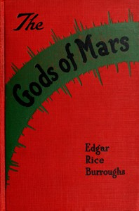

# The Gods of Mars <kbd>v2.2.1</kbd>

## Authors

 - Burroughs, Edgar Rice <small>(1875 - 1950)</small>

## Translators

## Subjects

 - Carter, John (Fictitious character)
 - Dejah Thoris (Fictitious character)
 - Life on other planets
 - Mars (Planet)
 - Science fiction

## Readablility

 - **A1:** 75%
 - **A2:** 81%
 - **B1:** 88%
 - **B2:** 93%
 - **C1:** 98%
 - **C2:** 100%

## Words Count

 - **A1:** 486
 - **A2:** 454
 - **B1:** 796
 - **B2:** 1232
 - **C1:** 1399
 - **C2:** 921

## Source

<kbd>GUTHENBURGE:64</kbd>
