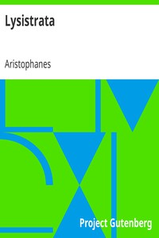

# Lysistrata <kbd>v2.2.1</kbd>

## Authors

 - Aristophanes <small>(-450 - -388)</small>

## Translators

 - Lindsay, Jack <small>(1900 - 1990)</small>

## Subjects

 - Aristophanes
 - Comedies
 - Greece
 - Greek drama (Comedy)
 - Lysistrata (Fictitious character)
 - Peace movements
 - Women and peace

## Readablility

 - **A1:** 74%
 - **A2:** 80%
 - **B1:** 85%
 - **B2:** 91%
 - **C1:** 97%
 - **C2:** 100%

## Words Count

 - **A1:** 455
 - **A2:** 315
 - **B1:** 474
 - **B2:** 612
 - **C1:** 622
 - **C2:** 425

## Source

<kbd>GUTHENBURGE:7700</kbd>
