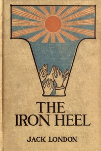

# The Iron Heel <kbd>v2.2.1</kbd>

## Authors

 - London, Jack <small>(1876 - 1916)</small>

## Translators

## Subjects

 - Dystopias
 - Oligarchy
 - Political fiction
 - Revolutionaries
 - Revolutions
 - Science fiction
 - Socialism

## Readablility

 - **A1:** 75%
 - **A2:** 80%
 - **B1:** 87%
 - **B2:** 93%
 - **C1:** 97%
 - **C2:** 100%

## Words Count

 - **A1:** 490
 - **A2:** 475
 - **B1:** 891
 - **B2:** 1374
 - **C1:** 1661
 - **C2:** 1190

## Source

<kbd>GUTHENBURGE:1164</kbd>
