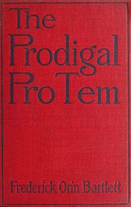

# The Prodigal Pro Tem <kbd>v2.2.1</kbd>

## Authors

 - Bartlett, Frederick Orin <small>(1876 - 1945)</small>

## Translators

## Subjects

 - Families
 - Impersonation
 - Interpersonal relations
 - Love stories
 - United States

## Readablility

 - **A1:** 78%
 - **A2:** 84%
 - **B1:** 89%
 - **B2:** 95%
 - **C1:** 98%
 - **C2:** 100%

## Words Count

 - **A1:** 491
 - **A2:** 450
 - **B1:** 754
 - **B2:** 1053
 - **C1:** 1053
 - **C2:** 648

## Source

<kbd>GUTHENBURGE:67997</kbd>
