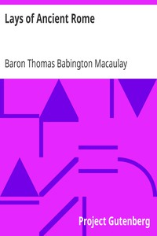

# Lays of Ancient Rome <kbd>v2.2.1</kbd>

## Authors

 - Macaulay, Thomas Babington Macaulay, Baron <small>(1800 - 1859)</small>

## Translators

## Subjects

 - Rome

## Readablility

 - **A1:** 72%
 - **A2:** 78%
 - **B1:** 85%
 - **B2:** 91%
 - **C1:** 97%
 - **C2:** 100%

## Words Count

 - **A1:** 470
 - **A2:** 399
 - **B1:** 609
 - **B2:** 854
 - **C1:** 883
 - **C2:** 502

## Source

<kbd>GUTHENBURGE:847</kbd>
