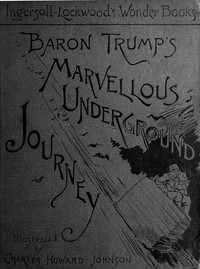

# Baron Trump's Marvellous Underground Journey <kbd>v2.2.1</kbd>

## Authors

 - Lockwood, Ingersoll <small>(1841 - 1918)</small>

## Translators

## Subjects

 - Adventure stories
 - Conduct of life
 - Courtship
 - Dogs
 - Fantasy fiction
 - Kings and rulers
 - Queens
 - Voyages and travels
 - Voyages, Imaginary
 - Wit and humor, Juvenile
 - Youth
 - Youth and death

## Readablility

 - **A1:** 74%
 - **A2:** 80%
 - **B1:** 87%
 - **B2:** 93%
 - **C1:** 98%
 - **C2:** 100%

## Words Count

 - **A1:** 492
 - **A2:** 464
 - **B1:** 828
 - **B2:** 1247
 - **C1:** 1383
 - **C2:** 778

## Source

<kbd>GUTHENBURGE:57426</kbd>
